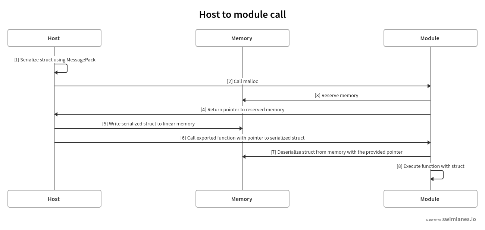
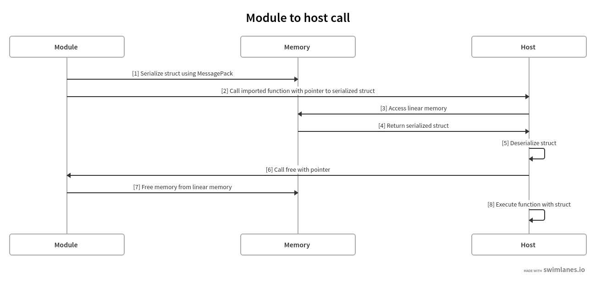
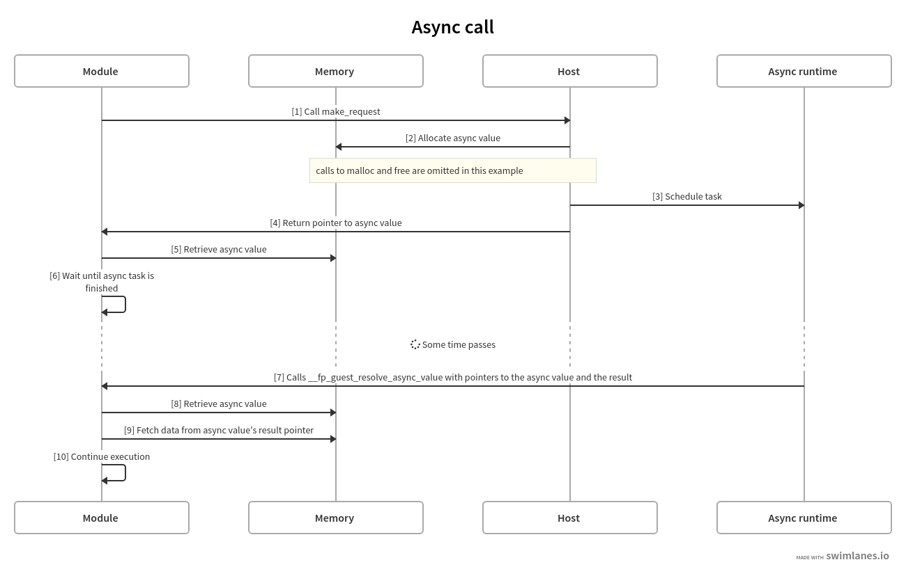

# Binding specification

This specification defines the primitives used for communication between the host runtime and the
guest module (plugin).

## Memory

The WebAssembly module is run in its own sandbox and won't have access to memory of the host. It
will instead have its own memory, sometimes referred to as linear memory. The guest has full access
to this memory and so does the host. For this reason, we use the guest's linear memory to pass
back-and-forth data structures in both direction.

Because we are using memory to pass along data structures we also need to allocate and free memory
on both sides. While the host has access to the guest's memory, it should not make assumptions about
how the guest is using its memory -- such assumptions would easily be broken if a guest is compiled
with a different compiler, especially when a different source language is used. Instead, we maintain
the guest's responsibility of allocating and freeing within its own memory.

This does mean the guest module will have to export a pair of functions to allocate and free memory,
`malloc()` and `free()` respectively. The host needs to call `malloc()` when it needs to export a
data structure to the module, and it needs to call `free()` once it deserialized a data structure
that it received from the module. Not calling `free()` will cause a memory leak in the linear
memory. Calling `free()` multiple times on the same pointer may cause memory corruptions.

## Serialization

WebAssembly is limited in the types that you can pass to functions and that functions return. For
the host and the WASM module to use more complex data structures, we need to use the linear memory
to first store the data structure and then return a pointer to it.

Any data structure that needs to be passed along the WASM bridge will first need to be serialized as
a `Vec<u8>` and will be stored in the linear memory. A parameter or a result of a function will then
pass along a "fat pointer", instead of using the data structure directly.

The other side that receives this fat pointer will use it to get the `Vec<u8>` from linear memory
and then deserialize it as the type that it expects it to be.

The serialization scheme we use is MessagePack. This is for its simple design, binary serialization
and wide support in different languages.

Example of a host making a call to an exported function in the wasm module ([source](https://swimlanes.io/#bZBBTgMxDEX3OYUPQC8wCzZQiU0lVJC6DonbWiTxyHFK4fSEZGbUlm4Sxfb/7zvvpAEHeOGsoAyRfQkIzoZgjC3KqcQPFMPiUfrYA2wwsnzXuw0b08Srx9Yd4A2FbKAfhKxSnELJlA5VlLM94Kt1n4ugGwzwVHEQ68HO9FrrNswAW8woJ4TY3uZiogO3qEUSjExJUf62kK7ws2ThTY47Ia3x5qB+TlqlgRJaWVh3k+J5ZNEq25fklDjBF+nxMsA/a3Nnr2fMt1+1F44Tu3vqEWEUPpGvVhPgymvKtT6jK3Wn60Td9Rc=)):

Example of a module making a call to an imported function from the host ([source](https://swimlanes.io/#bZBLTgMxDIb3OYUPUC4wCyTEQ2wqIcoFQuZva5HEleOohdOT6cyIYdSt/T8++4MtoqOt9DWCTOgoxSj4GJ3z1STX9Al1oj10lm1oiyT6vaHXJnZuMt/dT/OOdlD2kX9AxbQGo1o4H9q6FH/Amw9fS9eQ0tFj6yROJ1FDT/uag7FkOrMd6SScDTrwlTm6n7KdG/zL9ocQWhFFzvBK6Tp14/Kv7h1WNd+Im9NG2RPK6pZF3/WCiXyvwD/YG295GTQjT9NLWiGuqp8vCNWwesUI8Qs=)):

## Fat pointers

To be able to deserialize data from the linear memory it is required to know its offset, also known
as a pointer, and its length. A fat pointer encodes both.

A fat pointer is passed as an `i64` across the WASM bridge and contains both the offset and the
length of the data. Its 32 most-significant bits are used for the offset, while its 24
least-significant bits are used for the length. The bits in between are reserved for future
extension. Note this design currently limits the maximum encoded size of a single function argument
or return value to 16,777,215 bytes.

## Primitives

Not all data needs to be serialized and deserialized to be passed between the guest and the host.
Primitive types that fit into the numerical types that are natively supported by WASM, will be
passed directly.

The following Rust types don't require serialization:

- `bool`
- `f32`
- `f64`
- `i8`
- `i16`
- `i32`
- `i64`
- `u8`
- `u16`
- `u32`
- `u64`

Anything else is serialized as described above.

## Name mangling

To avoid conflicts, we mangle the names of functions imported and exported by the guest module.
The names for functions defined in the protocol are prefixed with `__fp_gen_`, while the names of
functions such as `malloc()` and `free()`, which are mandated by the spec, are prefixed with
`__fp_`.

Name mangling is hidden from users by the generated bindings. For instance, when the protocol
defines a function with a signature such as `fn my_function(data: MyType)`, this is also the
signature plugin authors and host implementors will see. But under the hood, it is communicated as
`fn __fp_gen_my_function(data: FatPtr)`.

## Namespacing

In addition to name mangling, we use the `"fp"` namespace for importing functions from the host.
Note that namespacing is only available on imports (not on exports).

# Async

At the moment there is no native async support in WebAssembly. Some runtimes highly recommend using
async, such as the browser. To enable support for async, we use a special data type called
`AsyncValue`. `AsyncValue` consists of three `i32` fields, in order:

- A status with value `0` (PENDING) or `1` (READY).
- An offset to the result, initialized at `0`.
- The length of the result, initialized at `0`.

Simply put, an async value is a fat pointer with a status prepended.

For any function that requires async functionality (this applies to both functions exported by the
module and functions imported by the module) a pointer to an `AsyncValue` is returned.

Assuming the returned async value had a PENDING status, the work is executed somewhere after
the value is returned. Once the actual result is available, the callee calls back to the caller
to inform them of the final result. Depending on the direction of the call, this calls either `__fp_guest_resolve_async_value` (when the guest was the caller) or `__fp_host_resolve_async_value`
(otherwise). Both functions receive two arguments: a fat pointer to the async value, and a fat
pointer to the actual result. Note how for async results, we use serialization even for primitives,
so that we can always consistently communicate a fat pointer. For async functions that don't produce
any result, the fat pointer will have a null value.

[Schematic overview](https://swimlanes.io/#nZHBTsMwEETv/oq9cWn7ATkgoUqISy+AxDFakg2xanuDvS6tEP/O2k3VVOLENZ6deTN5teKogYd0Ch106JwxmIVD9u8UDceeYgM77rOjFezIczyt4ImTrOabmINYT8acRbC+r88NbNUMPO6pjfSZKYkx5aEIzj6a6hx3KARYrQ7oMpnAokAFJYGwOhQRYOhhiKTSSMDeilAPNoCMNgEd0U+OrgE3aA28dCNVOMG0hytGJW7gmSTHABPbIBRL6JJnUezCrQfR0uGWeyGbfd/QChQGNwtrvPIONtikSMZsNpsGvgdM6zTZECj+wAt7BVVumDAlSsbctFkGbOtIbTtM7UdZWJdO7A7U1ri2csGXlfHSrS4q4w14nbZ80+Ps5D99Z9kjSTdCj4L6q9gv1Xdptr+QmD/22rI2DEpER+qyWA6/)

